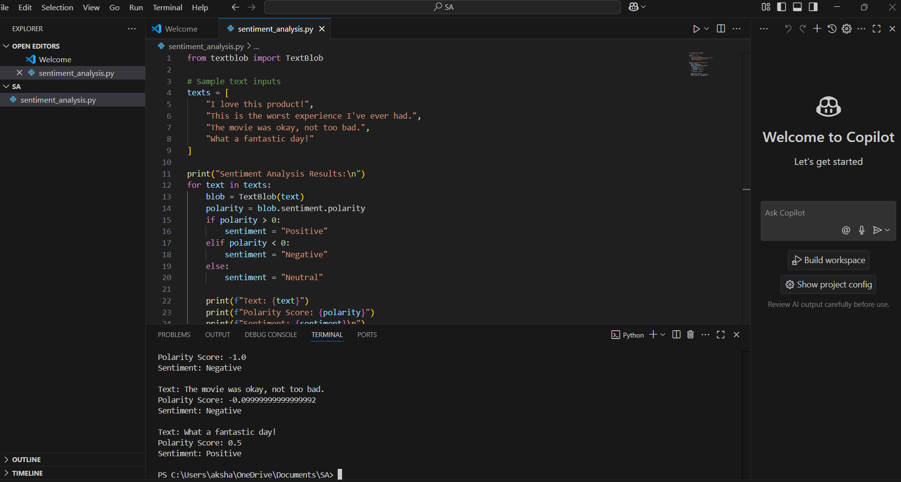

# Sentiment Analysis using AI/ML 🧠

## 📌 Overview

This project performs **Sentiment Analysis** to classify input text into **Positive**, **Negative**, or **Neutral** categories. Using machine learning and NLP techniques, it helps extract insights from customer reviews, social media posts, or any natural language data.

## 💡 Features

- Text classification into three sentiment classes
- Preprocessing using NLP (tokenization, stopword removal, etc.)
- Machine learning model training and evaluation
- Simple web interface for user input and prediction

## 🛠️ Tech Stack

- **Python**
- **Scikit-learn**
- **NLTK / SpaCy**
- **Flask**
- **HTML / CSS**
- **Matplotlib / Seaborn**
- **Jupyter Notebook**

## 🖼️ Project Screenshot



> Make sure `visuals/output_screenshot.png` exists and is committed to your repository.

## ⚙️ How to Run Locally

1. **Clone the Repository**
   ```bash
   git clone https://github.com/Akshaykumar1222/sentiment-analysis-ml.git
   cd sentiment-analysis-ml


## ⚙️ How to Run Locally

1. **Clone the Repository**
   ```bash
   git clone https://github.com/Akshaykumar1222/sentiment-analysis-ml.git
   cd sentiment-analysis-ml
2.Create Virtual Environment
  python -m venv venv
  source venv/bin/activate  # On Windows: venv\Scripts\activate

3.Install Dependencies
  pip install -r requirements.txt
  
4.Run the App
  python app.py
  
## Future Enhancements
Add support for multilingual sentiment analysis

Integrate with Twitter/X API for live sentiment feeds

Improve UI/UX with modern design

Deploy using Streamlit or AWS

 
## Developed By
Akshay Kumar
AI/ML Enthusiast | Developer | Innovator

 


